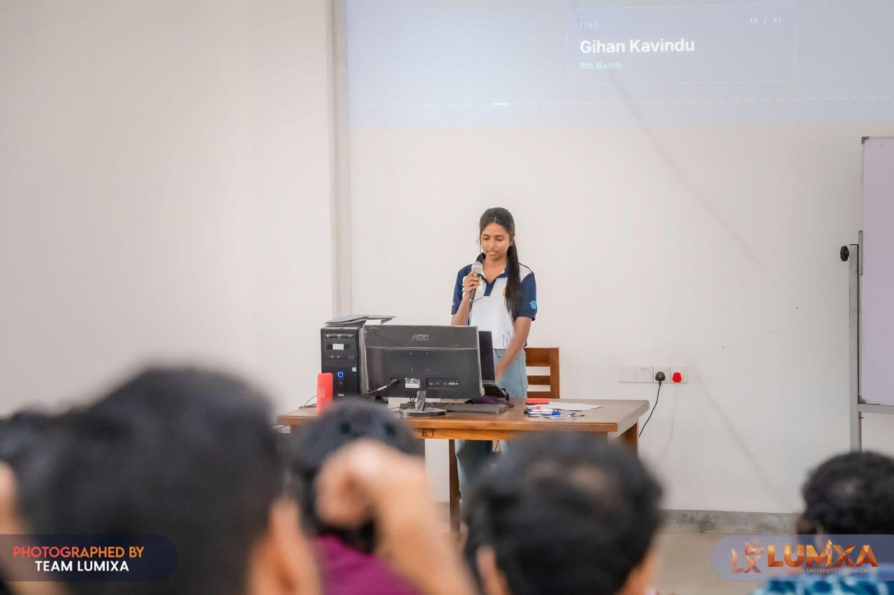

<h1 align="center">Hi 👋, I'm Dulsha Hemini</h1>

<h3 align="center">
BICT (Hons) Undergraduate @ University of Ruhuna | Aspiring Software Engineer
</h3>

  

 👩‍💻 About Me

- 🎓 Undergraduate at **University of Ruhuna**
- 📚 Studying **Bachelor of Information and Communication Technology (Hons)**
- 💻 Interested in **Software Engineering & Full-Stack Development**
- 🌱 Currently learning **Java, OOP, Data Structures & Algorithms, and MERN Stack**
- 🚀 Building **academic and personal projects** to improve my practical skills
- 🎯 Goal: Become a **Software Engineer / Full-Stack Developer**
- 📖 Improving my **problem-solving, Git/GitHub, and communication skills**
- ⚡ Fun fact: I love **coding, technology, Marvel/DC movies, and creating content**

 

---

### 🛠️ Languages and Tools

  

---

### 🚀 Current Projects

- 🛒 **UniMart** — Student marketplace built with the MERN Stack
- ☕ **Object-Oriented Programming Practicum** — Java practicals and OOP concepts
- 🧩 **Data Structures & Algorithms** — Implementing fundamental data structures
- 🌍 **Disaster Response Coordination System**
- 🏫 **Faculty Management System**

---

### 📊 GitHub Stats

  

  

---

### 🌐 Connect With Me

  
  

---

### ✨ Quote

> "Code • Learn • Repeat 💻✨"
